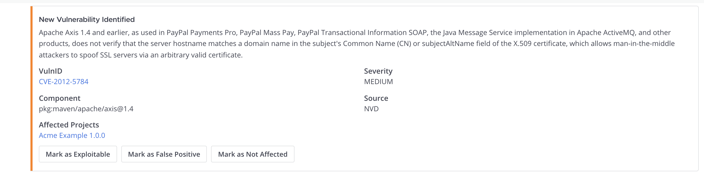
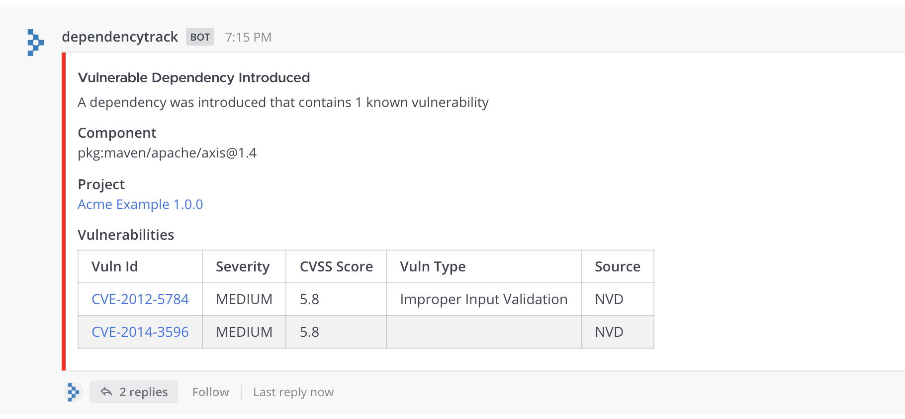
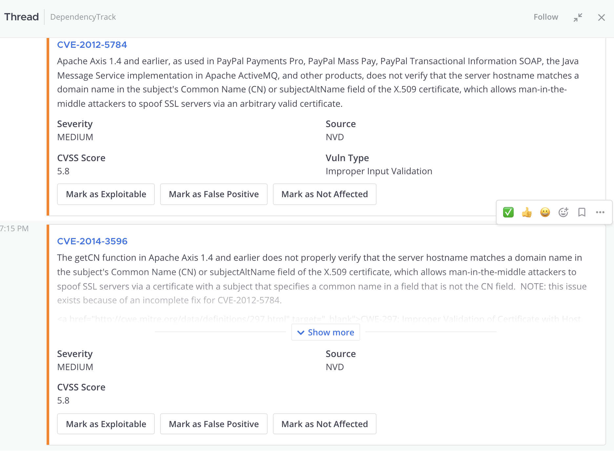
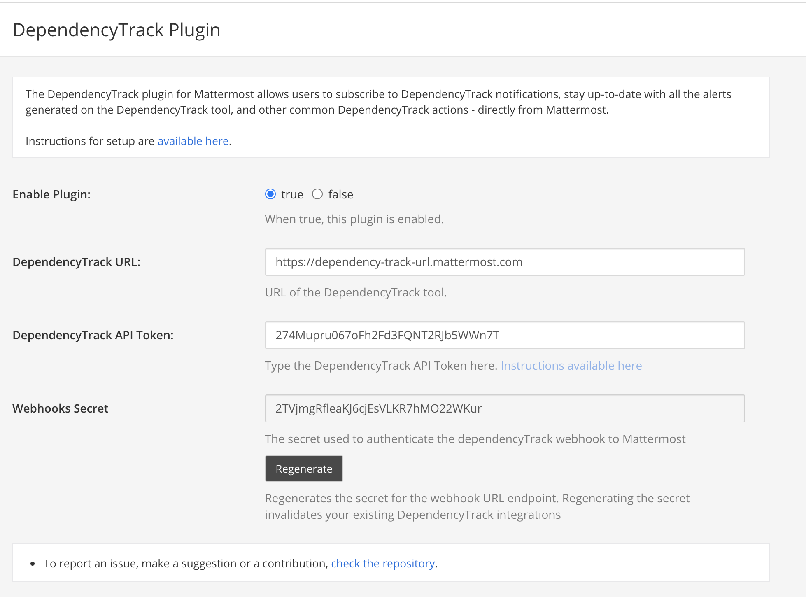
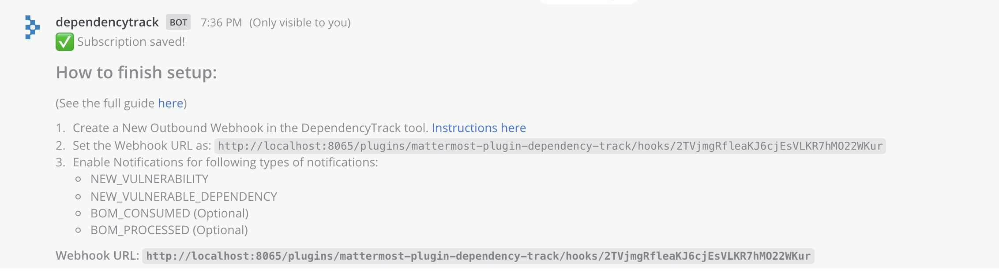

# Mattermost DependencyTrack Plugin

**Maintainer**: [@srkgupta](https://github.com/srkgupta)

## About DependencyTrack tool

The Dependency-Track tool from the website https://dependencytrack.org is an intelligent Component Analysis platform that allows organizations to identify and reduce risk in the software supply chain. Dependency-Track takes a unique and highly beneficial approach by leveraging the capabilities of Software Bill of Materials (SBOM). This approach provides capabilities that traditional Software Composition Analysis (SCA) solutions cannot achieve. Dependency-Track monitors component usage across all versions of every application in its portfolio in order to proactively identify risk across an organization. 

## About this plugin

This plugin allows you to perform following actions on Mattermost:

* Receive different notifications like NEW_VULNERABILITY, NEW_VULNERABLE_DEPENDENCY, BOM_PROCESSED from the DependencyTrack tool.
* Receive more context information for the notifications helping you analyze the alerts without having the need to visit the DependencyTrack tool. 
* Analyze the different alerts and mark them as Exploitable, Not Affected, False Positive directly from Mattermost. 
* An option is provided to consider the analysis for vulnerabilities for one project in reference to all the other projects.
* Synchronize status of all alerts across different project. 

Ultimately, this will make you or your team more productive and make the experience with the DependencyTrack tool much smoother.

### Screenshots

#### Notification about a New Vulnerability from the DependencyTrack tool

#### Notification about a New Vulnerable Dependency Introduced

#### Options to analyze the different vulnerabilities

### Audience

This guide is for Mattermost System Admins setting up the DependencyTrack plugin and Mattermost users who want information about the plugin functionality.

### Important notice

* If you are a DependencyTrack admin/user and think there is something this plugin lacks or something that it does could be done the other way around, let us know!
We are trying to develop this plugin based on users' needs.
* If there is a certain feature you or your team needs, open up an issue, and explain your needs.
We will be happy to help.

## Installing the plugin

1. Download the latest stable version of the plugin from the [releases page](https://github.com/mattermost/mattermost-plugin-dependency-track/releases)
2. In Mattermost, go to **System Console → Plugins → Management**
3. Upload the plugin in the **Upload Plugin** section
4. Configure the plugin before you enable it :arrow_down:

## Configuring the plugin

1. In Mattermost, go to **System Console → Plugins → Management** and click *Enable* underneath the DependencyTrack plugin
2. Click on *Settings* underneath the DependencyTrack plugin and update the DependencyTrack configurations as mentioned below:

    * **DependencyTrack URL**
        * URL of the DependencyTrack tool
    * **DependencyTrack API Token**
        * Please follow the instructions available at the following page to generate a API Token:
        https://docs.dependencytrack.org/integrations/rest-api/
        * Ensure that the `VULNERABILITY_ANALYSIS` permission is assigned. 
    * **Webhooks Secret**
        * The secret used to authenticate the dependencyTrack webhook to Mattermost.
        * Click on the Regenerate button to generate a new and unique webhook secret. 
        * Please note that regenerating the secret invalidates your existing DependencyTrack integrations
3. Click *Save* to save the settings
4. The plugin is now ready to use! :congratulations:

## Updating the plugin

To update the plugin repeat the [Installing the plugin](https://github.com/mattermost/mattermost-plugin-dependency-track#installing-the-plugin) step.

## Using the plugin

Interaction with the plugin involves using slash commands.

### Slash commands overview

* `/dtrack`
  * `subscriptions <list|add|delete>`
  * `permissions <list|add|delete>`
  * `project <reference/sync>`

### Slash commands documentation
##### subscriptions

`/dtrack subscriptions <list|add|delete>`

This action allows you to subscribe the current channel to receive DependencyTrack notifications. Once a channel is subscribed, the service will:

* notify the subscribed channel whenever there are new alerts from the DependencyTrack tool.

###### subscriptions add

When executed, the current channel will be subscribed to receive notifications. This command will print the URL which should be configured as Outbound Webhooks URL in the DependencyTrack Tool. Once subscribed, the service will listen to any Webhook Events from the DependencyTrack tool and publish it on the subscribed channel.

Remember to follow the instructions in the DependencyTrack tool for the notifications to work. 

###### subscriptions list

This action allows you to list all the channels which has been set to receive all the DependencyTrack notifications.

###### subscriptions delete [index]

This action allows you to delete the specified subscription and hence that specific channel will stop receiving any notifications for any events from DependencyTrack. You can run the command `/dtrack subscriptions list` to get the index position. Note: The index position starts with 1.

##### permissions

`/dtrack permissions <list|add|delete>`

This action allows you to Access Control users who can run DependencyTrack slash commands. Note: By default, all system administrators can run the `/dtrack` slash commands.

###### permissions add @username

This action allows you to whitelist the user and allow them to run the DependencyTrack slash commands. For example: `/dtrack permissions add @user1`

###### permissions delete @username

This action allows you to delete the whitelisted user and prevent them from running the DependencyTrack slash commands. For example: `/dtrack permissions delete @user1`.

###### permissions list

This action allows you to list all the users who are allowed to run the DependencyTrack slash commands. Note: By default, all system administrators can run the `/dtrack` slash commands.

##### project reference 

`/dtrack project reference <add/list/delete>`

By default, DependencyTrack tool does not carries out existing analysis done on different project. As a result, we have to redo all the analysis manually which might be time consuming and redundant. 

Hence this option is provided to consider the analysis for vulnerabilities for one project in reference to all the other projects.

###### project reference add 

`/dtrack project reference add --project <project_id>`

When executed, all the analysis done in the specified project_id will be considered in other projects. Hence the plugin will do the following tasks before triggerring a notification on the subscribed channels:

- If Reference Project is configured, then the plugin will check the status of the triggered Vulnerability in the reference project_id and the package versions. 
- If the status in the reference project was marked as exploitable, false positive (or) not affected, then the plugin will update the analysis status accordingly in the new project and will ignore and will not send any notification. 
- If the status in the reference project was not set, only then the plugin will notify in the subscribed channels. 

###### project reference list

This action will list the reference project set. If no reference project was set, it will display an appropriate message. 

###### project reference delete 

This action will delete the reference project set. 

##### project sync 

`/dtrack project sync --reference-project <project_id> --target-project <project_id>`

This command will check the status of all alerts from the reference_project_id and update the same to the target_project_id. 

## Contributing

<!-- TODO(amwolff): Write more about contributing to the plugin. Add CONTRIBUTING.md? -->

This repository uses the [mattermost-plugin-starter-template](https://github.com/mattermost/mattermost-plugin-starter-template).
Therefore, developing this plugin is roughly the same as it is with every plugin using the template.
All the necessary steps to develop are in the template's repository.

### Reporting security vulnerabilities

You can report security vulnerabilities to @rohitesh.gupta at the [Community Server](https://community.mattermost.com/).
Please adhere to the [Responsible Disclosure Policy](https://mattermost.com/security-vulnerability-report/).

